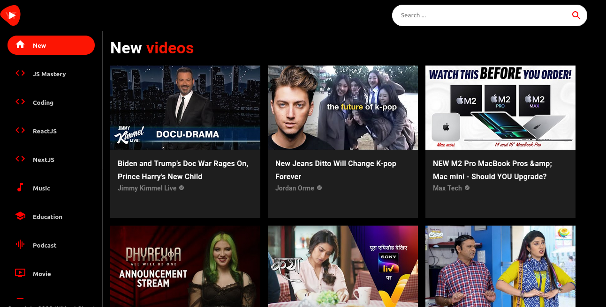

# Youtube Clone App

## About
The Youtube clone app is a ReactJs application. It uses the Youtube-V3 API from RapidAPI to fetch and share Youtube content.

## Libraries and Dependencies

**React**
- React is a free and open-source frpnt-end Javascript library for single page web application using UI components.

**React Router Dom**
- React Router DOM is a routing library for React to implement dynamic routing in a web app. 

**Material UI**
- Material UI is an open-source React component library that implements Google's Material Design. It includes a comprehensive collection of prebuilt components that are ready for use in production.

**React Player**
- A React component for playing a variety of URLs, including file paths, YouTube, Facebook, Twitch, SoundCloud, Streamable, Vimeo, Wistia, Mixcloud, DailyMotion and Kaltura.

**Axios**
- Axios is a promise-based HTTP library that is used to make requests to and fetch data from  API.

**RapidAPI**
- RapidAPI is the world largest API hub where millions of APIs can be found, tested and connected to.

## Installation and Setup Instructions

1. Download or clone this repository 
   *You will need **node** and **npm** installed globally on your machine*

2. cd into the project folder and install dependencies

  `$ npm install`

3. Start the application.
  
  `$ npm start`

**Thank you. Enjoy It!**

